# Artworkia - Artwork Sharing Platform

👋 Welcome to our Capstone Project Artworkia 👋

## Table of Contents

- [Description](#description)
- [Preview Screenshot](#preview-screenshot)
- [Technology](#technology)
- [Main Features](#main-features)
- [Contributors](#contributors)
- [License & Copyright](#license--copyright)

## Description

- A social web application platform for digital artworks.
- Serves as an intermediary connecting creators and audiences who appreciate their artworks.
- Facilitates creators and audiences in selling and buying assets related to the artworks.
- Enables creators to offer creative content services upon request.

## Preview Screenshot

  </img> &nbsp;&nbsp; 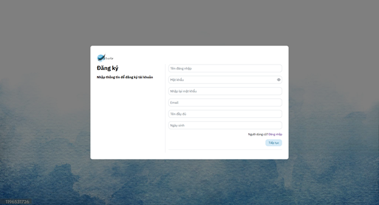</img>
  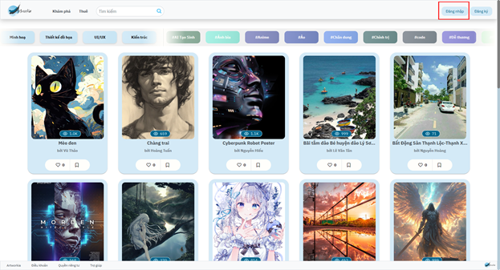</img>
  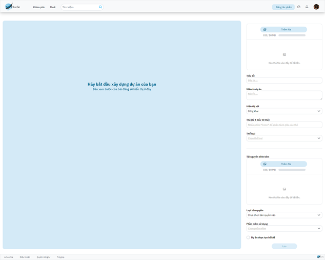</img> &nbsp;&nbsp; 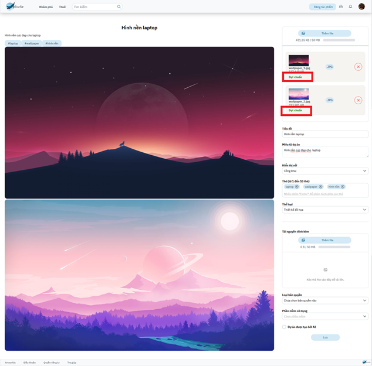</img>
  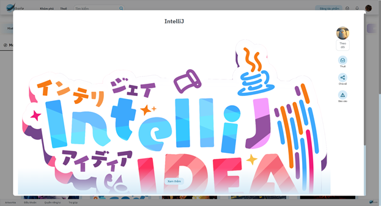</img> &nbsp;&nbsp; </img>
  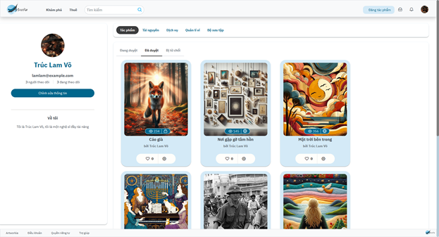</img> &nbsp;&nbsp; 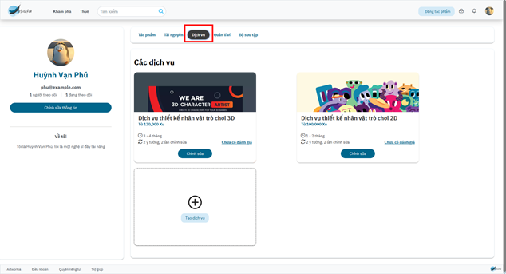</img>
  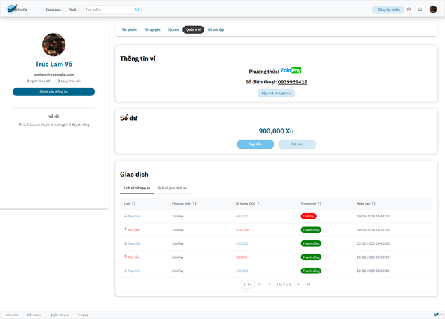</img> &nbsp;&nbsp; 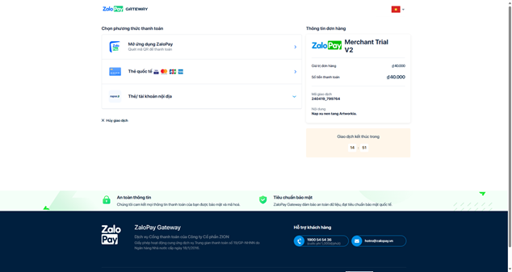</img>
  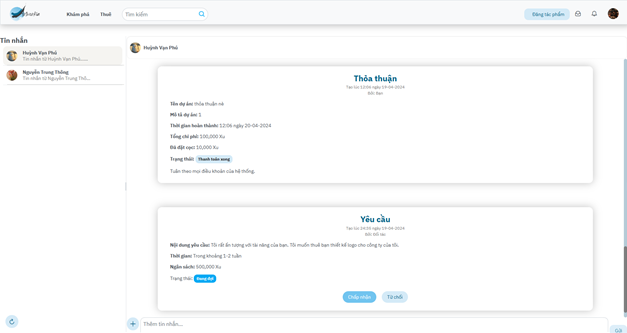</img>
  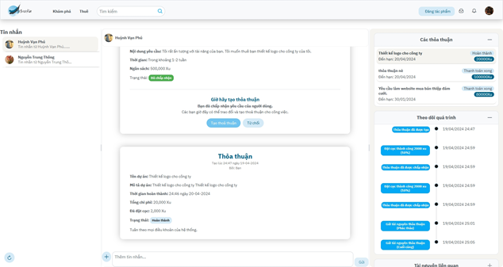</img> &nbsp;&nbsp; 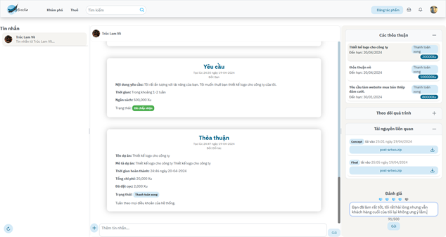</img>

## Technology

**Client:** ReactJS, NSFWJS, PrimeReact

**Server:** Microsoft .Net, Microsoft SQL Server

**Deployment:** Docker, Jenkins, Google Cloud, Firebase Hosting

**Third-party:** ZaloPay, Elastic Search, Cloudflare

## Main features
**1. Guest:**
- [x]  Login
- [x]  Login by Google
- [x]  Register

**2. Creator:**
- [x]  Profile Management
- [x]  Artwork Management
- [x]  Asset Management
- [x]  Service Management
- [x]  Proposal Management
- [x]  Chat
- [x]  Report
- [x]  Notification

**3. Audience**
- [x]  Collection Management
- [x]  Request Management
- [x]  Chat
- [x]  Report
- [x]  Notification

## Contributors
**1. Mentor:**
- Lecturer - Main Mentor: Nguyen Thi Cam Huong

**2. Members:**
- [Vo Ngoc Truc Lam](https://github.com/vliam0206) - SE160857 - **Leader | Back-end Developer**
- [Huynh Van Phu](https://github.com/hvpexe) - SE140456 - **Back-end Developer | DevOps**
- [Dang Hoang Anh](https://github.com/danghoanganh36) - SE160846 - **Front-end Developer**
- [Nguyen Trung Thong](https://github.com/thongnt0208) - SE160850 - **Front-end Developer**
  
## License & Copyright 
&copy; 2024 GSP24SE42-SP24SE061-Artworkia
